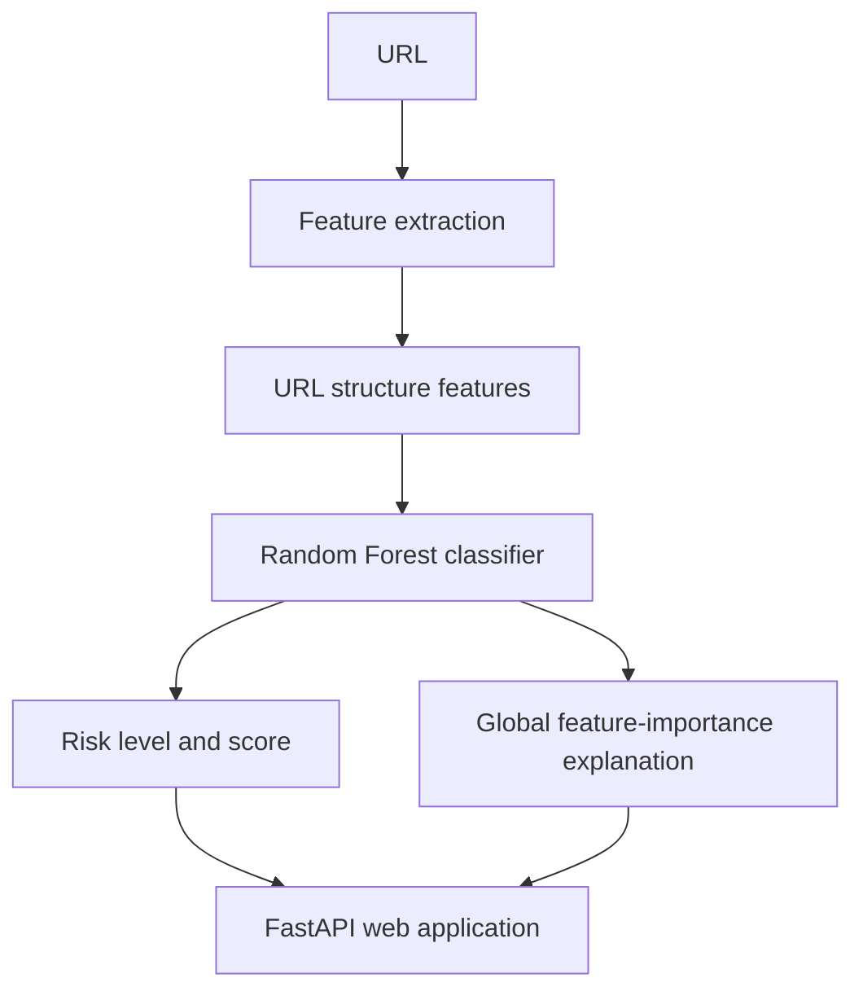

# PhishGuard AI

**An explainable phishing URL detection project**

PhishGuard AI is a personal cybersecurity and machine-learning project. It
checks the structure of a URL for patterns commonly associated with phishing
and returns a risk estimate with reasons that a non-technical user can
understand.

The project brings together feature engineering, model comparison, explainable
prediction, automated testing, a FastAPI web application, and a static GitHub
Pages portfolio.

> **Important:** This is an educational estimate. It does not guarantee that a
> URL is safe or malicious and should not replace advice from a bank, security
> team, or established security product.

## What it can do

- Analyse URLs without opening the destination website
- Classify a URL as LOW, MEDIUM, or HIGH risk
- Return a model risk score
- Highlight suspicious URL characteristics
- Show model feature-importance explanations behind the result
- Display technical URL features using clearer labels
- Provide practical next steps for non-technical users
- Offer a local, in-browser safety assistant
- Store recent scans only in the browser's local storage
- Publish a project portfolio through GitHub Pages

## Project summary

PhishGuard AI is an explainable machine-learning system for detecting
potentially malicious URLs. The v1 model uses 16 URL-based features and a
Random Forest classifier. A follow-up experiment investigated a reported
false positive, added hard-negative training examples, tested ten additional
hostname/path/query features, and measured thresholds on a domain-disjoint
test split. The experiment is documented separately from the deployed v1
artifact; it does not imply that URL-only analysis can establish whether a
site is safe.

## How it works

```text
URL
 │
 ▼
Feature extraction
 │
 ▼
16 model features (10 additional features evaluated experimentally)
 │
 ▼
Random Forest model
 │
 ▼
Risk level, indicators, and explanation
```

The system does not download or interact with the webpage. It analyses
characteristics contained in the URL itself.



## Machine learning

The released v1 model was trained using an earlier PhishTrap snapshot. For a
reproducible follow-up experiment, this repository pins the MIT-licensed
[`saidutta69/PhishTrap` dataset](https://huggingface.co/datasets/saidutta69/PhishTrap)
at revision
`26dc2bff5f8c26346f26611bab102f8d0a0fc7c2`. Its build manifest identifies
build `20260926T022930Z`, with 19,948 rows (9,974 per label), 16 stored URL
features, the original URL, and provenance fields. The pinned CSV's SHA-256 is
`2b66391ff8af4e63c35648b65b399a4c590ea094733dda00534174e11196fc3c`.

The dataset card reports 19,954 rows, but the manifest and CSV at the pinned
revision both contain 19,948. The loader checks the pinned checksum, row count,
and class balance instead of trusting the card's stale count.

The raw dataset is excluded from Git. The small trained model artifact is
included because it is needed to run the application; it does not contain the
raw URLs.

### Features

| Feature | Description |
|---|---|
| `url_length` | Length of the URL |
| `hyphen_count` | Number of hyphens |
| `digit_count` | Number of digits |
| `subdomain_count` | Number of subdomains |
| `trusted_tld` | Whether the TLD belongs to a selected trusted set |
| `protocol_exists` | Whether HTTP or HTTPS is present |
| `special_char_count` | Number of selected special characters |
| `entropy` | Shannon entropy of the URL |
| `path_depth` | Number of path levels |
| `domain_length` | Length of the hostname |
| `is_domain_ip` | Whether an IP address is used as the domain |
| `has_at_symbol` | Whether `@` appears in the URL |
| `has_double_slash_redirect` | Whether multiple `//` sequences occur |
| `tld_length` | Length of the TLD |
| `query_param_count` | Number of query parameters |
| `path_length` | Length of the URL path |

These 16 URL-only features are the inputs used by the current and candidate
Random Forests. Long or unusually complex URLs, many subdomains, raw IP
addresses, `@` symbols, redirect-like syntax, and high character entropy can
occur in phishing links. They are not proof of malicious intent.

The extractor also exposes ten experimental features that distinguish parts
of the URL:

| Experimental feature | Scope |
|---|---|
| `hostname_entropy` | Hostname only |
| `domain_digit_ratio` | Digits in the registrable domain label |
| `path_digit_ratio` | Digits in the URL path |
| `query_length` | Query string only |
| `hostname_hyphen_count` | Hostname only |
| `domain_token_count` | Tokens in the registrable domain label |
| `suspicious_keyword_count` | Authentication-related terms in path/query |
| `percent_encoded_count` | Valid percent-encoded octets |
| `punycode_detected` | Whether a hostname label uses the `xn--` form |
| `registered_domain_length` | Registrable domain, excluding subdomains |

The 26-feature model did not outperform the 16-feature model on the
domain-disjoint test set, so those ten features are not used by the current
candidate model.

### False-positive investigation and model comparison

The reported FastAPI Cloud dashboard URL was HIGH under the released model
(86.37% model risk score). Its hostname alone, with no path, was also HIGH
(78.06%) and had no heuristic indicators. This established that the model
score—not the human-readable indicator rules—caused the false positive.
After training with generated legitimate hard negatives, the 16-feature
candidate scored the reported URL at 69.76% (MEDIUM under the existing 0.75
HIGH cutoff). The 26-feature candidate scored it at 75.01% (HIGH).

The upstream PhishTrap train/validation/test files share registrable domains
(366 between train/validation, 416 between train/test, and 164 between
validation/test). The experiment therefore re-splits the pinned full CSV with
`StratifiedGroupKFold`, keeping registrable domains disjoint:

- Train: 13,959 rows
- Validation: 2,995 rows
- Test: 2,994 rows

Five-fold cross-validation is also grouped by registrable domain. The
hard-negative training augmentation creates five complex URL patterns on
each of 200 deterministically selected legitimate training hosts (1,000
additional label-0 examples). These paths are synthetic; they are not asserted
to exist on the corresponding sites.
The selected model's five-fold grouped cross-validation accuracy was 84.75%
(standard deviation 0.92%).

Test-set results at a binary decision threshold of 0.50:

| Model | Features | Accuracy | Precision | Recall | F1 | ROC-AUC | FP | FN |
|---|---:|---:|---:|---:|---:|---:|---:|---:|
| Random Forest baseline | 16 | 87.14% | 88.56% | 85.30% | 86.90% | 0.9398 | 165 | 220 |
| Random Forest + hard negatives | 16 | **87.58%** | **89.53%** | 85.10% | **87.26%** | **0.9401** | **149** | 223 |
| Random Forest + hard negatives | 26 | 86.07% | 86.59% | 85.37% | 85.97% | 0.9357 | 198 | 219 |

The selected 16-feature hard-negative model reduced test false positives by
16, with three additional false negatives relative to the 16-feature baseline.

The constructed hard-case set contains 501 legitimate cases (500 generated
from held-out Tranco domains and the user-supplied dashboard URL) and 100
phishing cases from the pinned validation split prioritized for HTTPS, trusted
TLDs, no IP address, no `@` symbol, and shorter URL lengths. At threshold
0.50 the model made one false positive and missed 88 of those 100 difficult
phishing cases. This stress set is biased by design and is not a prevalence
estimate; it shows that URL-structure-only features can still miss phishing
URLs that resemble legitimate URLs.

Thresholds are measured, not silently changed. On the held-out test split,
the candidate at 0.75 had 48 false positives and 359 false negatives (FPR
3.21%, FNR 23.98%). At 0.80 it had 31 false positives and 408 false negatives
(FPR 2.07%, FNR 27.25%); at 0.85 it had 20 false positives and 486 false
negatives. The HIGH cutoff remains at 0.75 to preserve phishing recall; the
reported dashboard case scores MEDIUM at 69.76%. The dataset is balanced
50/50, so precision and model scores do not represent real-world phishing
likelihood.

## Web application

The FastAPI application is a single-page interface containing the welcome
section, detector, results, recent scan history, and safety assistant.

The main API endpoint is:

```text
POST /api/analyze
```

Example request:

```json
{
  "url": "https://example.com"
}
```

The response includes the classification, model risk score, risk level,
security indicators, extracted features, and feature-importance explanation.

## Installation and local use

Clone the repository and create a virtual environment:

```powershell
git clone https://github.com/rtl-gli/PhishGuard-AI.git
cd PhishGuard-AI
python -m venv .venv
.venv\Scripts\Activate.ps1
python -m pip install -r requirements.txt
```

Start the web application:

```powershell
uvicorn app.main:app --reload --port 8001
```

Open:

```text
http://127.0.0.1:8001/
```

The API documentation is available at:

```text
http://127.0.0.1:8001/docs
```

Run the command-line tools:

```powershell
python -m src.predict "https://example.com"
python -m src.explain "https://example.com"
python -m src.evaluate
python -m src.compare_models
```

### Reproducing the experiments

The raw PhishTrap CSV and generated splits are intentionally not tracked in
Git. Download the pinned MIT-licensed snapshot (revision
`26dc2bff5f8c26346f26611bab102f8d0a0fc7c2`) from Hugging Face:

```powershell
$revision = "26dc2bff5f8c26346f26611bab102f8d0a0fc7c2"
New-Item -ItemType Directory -Force "data\raw" | Out-Null
Invoke-WebRequest `
  -Uri "https://huggingface.co/datasets/saidutta69/PhishTrap/resolve/$revision/data/phishtrap_full.csv" `
  -OutFile "data\raw\phishtrap_full.csv"
```

The loader verifies the file's SHA-256, 19,948 rows, and balanced labels. It
also verifies that the dataset's stored 16 features match the runtime feature
extractor. Prepare deterministic 70/15/15 train/validation/test splits with
registrable domains kept disjoint:

```powershell
python -m src.prepare_dataset
```

For the local hard-case experiment, prepare difficult legitimate URL patterns
and phishing examples selected by HTTPS, TLD, IP, `@`, and URL-length
characteristics. Optionally pass a known-legitimate URL to include it in the
local regression set:

```powershell
python -m src.prepare_hard_cases --legitimate-url "https://example.com/a/long/path?source=newsletter"
```

The hard-case files contain phishing URLs. They are Git-ignored; do not open
them in a browser. Then run:

```powershell
python -m src.train
python -m src.compare_models
python -m src.evaluate
```

Training writes a candidate model rather than overwriting the released
artifact. Comparison includes Logistic Regression, Decision Tree, 16-feature
and 26-feature Random Forests, and both hard-negative-augmented Random Forest
variants. Evaluation reports precision, recall, F1, ROC-AUC, false-positive
and false-negative counts/rates, five-fold group-stratified cross-validation,
and threshold sweeps on validation, held-out test, and constructed hard cases.
The scores are for a balanced dataset and should not be interpreted as
real-world calibrated probabilities. After reviewing the results, promote the
candidate with:

```powershell
python -m src.promote_model
```

## Testing

Run the automated tests with:

```powershell
python -m pytest
```

The tests cover URL feature extraction, entropy, protocol detection, IP
address detection, `@` symbols, query parameters, legitimate URL examples,
suspicious URL examples, malformed-input handling, length limits, and the
analysis API response.

The security regression set includes safe examples such as
`https://google.com` and `https://example.com`, plus non-operational
suspicious patterns such as IP-address hosts, `@` user-info, nested
subdomains, redirect-like paths, long URLs, and many query parameters.

## Public portfolio

The `docs/` directory contains a static portfolio site for GitHub Pages. It
explains the project, shows the evaluation results, includes a safety FAQ, and
links back to the source code.

To publish it:

1. Open the repository's **Settings → Pages**.
2. Select **Deploy from a branch**.
3. Choose branch `main`.
4. Choose the `/docs` folder.
5. Save.

The public portfolio address is:

```text
https://rtl-gli.github.io/PhishGuard-AI/
```

GitHub Pages cannot run the Python backend. The full detector therefore runs
locally unless it is deployed to a Python-capable hosting service.

## Project structure

```text
PhishGuard AI/
├── app/
│   ├── main.py
│   ├── templates/index.html
│   └── static/
│       ├── style.css
│       ├── script.js
│       └── chat.js
├── docs/
│   ├── index.html
│   ├── styles.css
│   ├── overrides.css
│   └── script.js
├── model/phishing_model.pkl
├── src/
│   ├── features.py
│   ├── project.py
│   ├── train.py
│   ├── predict.py
│   ├── evaluate.py
│   ├── explain.py
│   └── compare_models.py
├── tests/
├── requirements.txt
└── README.md
```

## Limitations

- The model analyses URL characteristics only.
- It does not inspect webpage content.
- It does not execute websites or inspect page DOM.
- It does not inspect certificates or query threat-intelligence feeds.
- It does not check live domain reputation.
- The dataset may not represent real-world URL distributions.
- The dataset is balanced, while real-world phishing prevalence is not.
- Likelihood outputs are model scores, not guaranteed probabilities.
- Heuristic indicators are separate from model feature-importance explanations.
- A legitimate-looking URL can still lead to malicious content.

The explanation shown in the application is based on global Random Forest
feature importance. It indicates which features are important to the trained
model overall; it is not a causal explanation for one individual prediction.

## Deployment

The included `Dockerfile` runs the FastAPI application on the port supplied by
the `PORT` environment variable. A deployment service must provide the
tracked model artifact and install `requirements.txt`; the raw training
dataset is not required to serve predictions.

```powershell
docker build -t phishguard-ai .
docker run --rm -p 8000:8000 -e PORT=8000 phishguard-ai
```

## Future development

- Cross-validation and probability calibration
- More diverse training data
- Improved threshold analysis
- Browser extension support
- Email phishing analysis
- Domain reputation checking
- More advanced models

## Technologies

**Python:** pandas, NumPy, scikit-learn, joblib, tld, pytest

**Web:** FastAPI, Uvicorn, HTML, CSS, JavaScript
**Development:** Git, GitHub, VS Code

## Author

Developed as a personal cybersecurity and machine-learning project exploring
practical applications of AI, explainability, and user-focused security
design.
