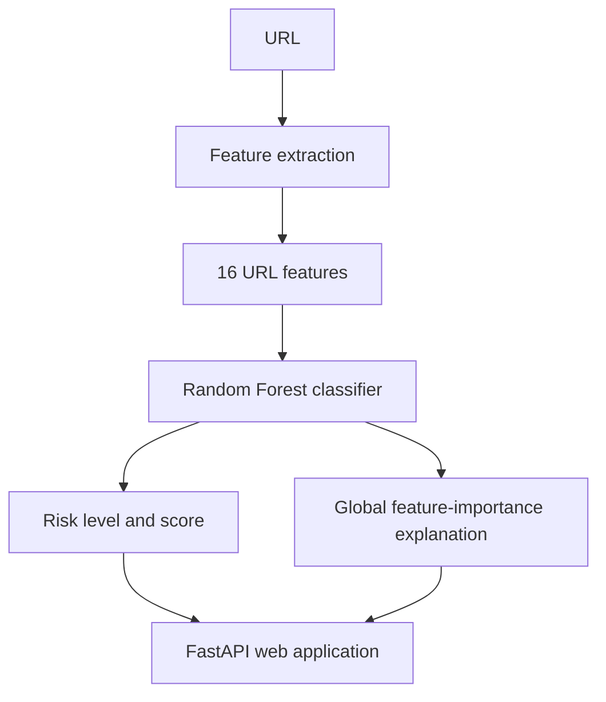

# PhishGuard AI

**An explainable phishing URL detection project**

PhishGuard AI is a personal cybersecurity and machine-learning project. It
checks the structure of a URL for patterns commonly associated with phishing
and returns a risk estimate with reasons that a non-technical user can
understand.

The project brings together feature engineering, model comparison, explainable
prediction, automated testing, a FastAPI web application, and a static GitHub
Pages portfolio.

> **Important:** This is an educational estimate. It does not guarantee that a
> URL is safe or malicious and should not replace advice from a bank, security
> team, or established security product.

## What it can do

- Analyse URLs without opening the destination website
- Classify a URL as LOW, MEDIUM, or HIGH risk
- Return an estimated phishing likelihood
- Highlight suspicious URL characteristics
- Show model feature-importance explanations behind the result
- Display technical URL features using clearer labels
- Provide practical next steps for non-technical users
- Offer a local, in-browser safety assistant
- Store recent scans only in the browser's local storage
- Publish a project portfolio through GitHub Pages

## How it works

```text
URL
 │
 ▼
Feature extraction
 │
 ▼
16 URL features
 │
 ▼
Random Forest model
 │
 ▼
Risk level, indicators, and explanation
```

The system does not download or interact with the webpage. It analyses
characteristics contained in the URL itself.



## Machine learning

The model was trained using the PhishTrap URL dataset:

- 19,944 URLs
- 9,972 legitimate URLs
- 9,972 phishing URLs
- 16 URL-based features

The raw dataset is excluded from Git. The small trained model artifact is
included because it is needed to run the application; it does not contain the
raw URLs.

### Features

| Feature | Description |
|---|---|
| `url_length` | Length of the URL |
| `hyphen_count` | Number of hyphens |
| `digit_count` | Number of digits |
| `subdomain_count` | Number of subdomains |
| `trusted_tld` | Whether the TLD belongs to a selected trusted set |
| `protocol_exists` | Whether HTTP or HTTPS is present |
| `special_char_count` | Number of selected special characters |
| `entropy` | Shannon entropy of the URL |
| `path_depth` | Number of path levels |
| `domain_length` | Length of the hostname |
| `is_domain_ip` | Whether an IP address is used as the domain |
| `has_at_symbol` | Whether `@` appears in the URL |
| `has_double_slash_redirect` | Whether multiple `//` sequences occur |
| `tld_length` | Length of the TLD |
| `query_param_count` | Number of query parameters |
| `path_length` | Length of the URL path |

These features are deliberately URL-only signals: long or unusually complex
URLs, many subdomains, raw IP addresses, `@` symbols, redirect-like syntax,
and high character entropy can occur in phishing links. They are not proof of
malicious intent, so the application presents them as signals rather than
verdicts.

### Model selection

Logistic Regression was used as a baseline with 82.88% test accuracy. Several
Decision Tree depths were then compared using the same train/test split.

| Max depth | Test accuracy | Phishing recall | Phishing F1 | False negatives |
|---:|---:|---:|---:|---:|
| 3 | 80.32% | 69.66% | 77.97% | 605 |
| 5 | 83.35% | 78.13% | 82.43% | 436 |
| **8** | **85.11%** | **81.14%** | **84.49%** | **376** |
| 12 | 84.26% | 79.24% | 83.42% | 414 |
| Unlimited | 82.88% | 76.78% | 81.76% | 463 |

The deployed artifact is a Random Forest with 200 trees and maximum depth 12.
The Decision Tree depth comparison above is an experiment used during model
selection. The final evaluation used 3,989 test samples:

- Accuracy: 85.11%
- Phishing precision: 88.13%
- Phishing recall: 81.14%
- Phishing F1 score: 84.49%
- Phishing false negatives: 376

False negatives matter particularly for a phishing detector because they are
phishing URLs classified as legitimate. The model output should therefore be
treated as an additional signal, not proof of safety.

The experiment uses a stratified 80/20 train/test split with
`random_state=42`. The test set is held out until prediction and metric
calculation; the five-fold cross-validation reported by `evaluate.py` is
performed on the full labelled dataset only as a separate stability estimate.
No test labels are used to fit the final model.

## Web application

The FastAPI application is a single-page interface containing the welcome
section, detector, results, recent scan history, and safety assistant.

The main API endpoint is:

```text
POST /api/analyze
```

Example request:

```json
{
  "url": "https://example.com"
}
```

The response includes the classification, estimated likelihood, risk level,
security indicators, extracted features, and feature-importance explanation.

## Installation and local use

Clone the repository and create a virtual environment:

```powershell
git clone https://github.com/rtl-gli/PhishGuard-AI.git
cd PhishGuard-AI
python -m venv .venv
.venv\Scripts\Activate.ps1
python -m pip install -r requirements.txt
```

Start the web application:

```powershell
uvicorn app.main:app --reload --port 8001
```

Open:

```text
http://127.0.0.1:8001/
```

The API documentation is available at:

```text
http://127.0.0.1:8001/docs
```

Run the command-line tools:

```powershell
python -m src.predict "https://example.com"
python -m src.explain "https://example.com"
python -m src.evaluate
python -m src.compare_models
```

### Reproducing the experiments

The raw PhishTrap CSV is intentionally not tracked in Git. To reproduce the
experiments, obtain the project copy of `phishtrap_full.csv` and place it at:

```text
data/raw/phishtrap_full.csv
```

The expected dataset has 19,944 rows, 16 feature columns, and a `label`
column containing 9,972 legitimate and 9,972 phishing examples. The scripts
validate the required columns before running. From the repository root, run:

```powershell
python -m src.train
python -m src.compare_models
python -m src.evaluate
```

The training and evaluation split uses `random_state=42`, stratification, and
an 80/20 test split. Evaluation also reports five-fold stratified
cross-validation. If the dataset is missing, the scripts report the expected
location and do not silently fall back to another dataset.

## Testing

Run the automated tests with:

```powershell
python -m pytest
```

The tests cover URL feature extraction, entropy, protocol detection, IP
address detection, `@` symbols, query parameters, legitimate URL examples,
suspicious URL examples, malformed-input handling, length limits, and the
analysis API response.

The security regression set includes safe examples such as
`https://google.com` and `https://example.com`, plus non-operational
suspicious patterns such as IP-address hosts, `@` user-info, nested
subdomains, redirect-like paths, long URLs, and many query parameters.

## Public portfolio

The `docs/` directory contains a static portfolio site for GitHub Pages. It
explains the project, shows the evaluation results, includes a safety FAQ, and
links back to the source code.

To publish it:

1. Open the repository's **Settings → Pages**.
2. Select **Deploy from a branch**.
3. Choose branch `main`.
4. Choose the `/docs` folder.
5. Save.

The public portfolio address is:

```text
https://rtl-gli.github.io/PhishGuard-AI/
```

GitHub Pages cannot run the Python backend. The full detector therefore runs
locally unless it is deployed to a Python-capable hosting service.

## Project structure

```text
PhishGuard AI/
├── app/
│   ├── main.py
│   ├── templates/index.html
│   └── static/
│       ├── style.css
│       ├── script.js
│       └── chat.js
├── docs/
│   ├── index.html
│   ├── styles.css
│   ├── overrides.css
│   └── script.js
├── model/phishing_model.pkl
├── src/
│   ├── features.py
│   ├── project.py
│   ├── train.py
│   ├── predict.py
│   ├── evaluate.py
│   ├── explain.py
│   └── compare_models.py
├── tests/
├── requirements.txt
└── README.md
```

## Limitations

- The model analyses URL characteristics only.
- It does not inspect webpage content.
- It does not execute websites or inspect page DOM.
- It does not inspect certificates or query threat-intelligence feeds.
- It does not check live domain reputation.
- The dataset may not represent real-world URL distributions.
- The dataset is balanced, while real-world phishing prevalence is not.
- Likelihood outputs are model scores, not guaranteed probabilities.
- Heuristic indicators are separate from model feature-importance explanations.
- A legitimate-looking URL can still lead to malicious content.

The explanation shown in the application is based on global Random Forest
feature importance. It indicates which features are important to the trained
model overall; it is not a causal explanation for one individual prediction.

## Deployment

The included `Dockerfile` runs the FastAPI application on the port supplied by
the `PORT` environment variable. A deployment service must provide the
tracked model artifact and install `requirements.txt`; the raw training
dataset is not required to serve predictions.

```powershell
docker build -t phishguard-ai .
docker run --rm -p 8000:8000 -e PORT=8000 phishguard-ai
```

## Future development

- Cross-validation and probability calibration
- More diverse training data
- Improved threshold analysis
- Browser extension support
- Email phishing analysis
- Domain reputation checking
- More advanced models

## Technologies

**Python:** pandas, NumPy, scikit-learn, joblib, tld, pytest

**Web:** FastAPI, Uvicorn, HTML, CSS, JavaScript
**Development:** Git, GitHub, VS Code

## Author

Developed as a personal cybersecurity and machine-learning project exploring
practical applications of AI, explainability, and user-focused security
design.
